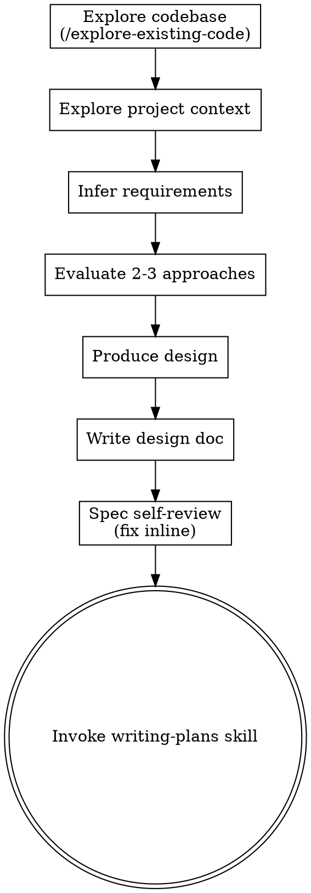

# Brainstorming Ideas Into Designs

Turn ideas into fully formed designs and specs through autonomous analysis.

Understand the current project context, infer requirements from the task and codebase, then produce a design and proceed to implementation — no human approval gates.

## Anti-Pattern: "This Is Too Simple To Need A Design"

Every project goes through this process. A todo list, a single-function utility, a config change — all of them. "Simple" projects are where unexamined assumptions cause the most wasted work. The design can be short (a few sentences for truly simple projects), but you MUST produce one.

## Checklist

You MUST create a task for each of these items and complete them in order:

1. **Read references** — read all reference files listed in the skill that triggered brainstorming (e.g. `references/1-dry.md`, `references/2-srp.md`, etc.) to ground design decisions in project principles
2. **Explore codebase** — run `/explore-existing-code` to generate a repo map and understand everything already implemented
3. **Explore project context** — check relevant files, docs, recent commits for additional context
4. **Infer requirements** — derive purpose, constraints, and success criteria from the task description and codebase
5. **Evaluate 2-3 approaches** — with trade-offs, pick the best one (apply reference principles when comparing)
6. **Produce design** — in sections scaled to their complexity
7. **Write design doc** — save to `docs/superpowers/specs/YYYY-MM-DD-<topic>-design.md` and commit
8. **Spec self-review** — quick inline check for placeholders, contradictions, ambiguity, scope (see below)
9. **Transition to implementation** — invoke writing-plans skill to create implementation plan

## Process Flow

**The terminal state is invoking writing-plans.** Do NOT invoke frontend-design, mcp-builder, or any other implementation skill. The ONLY skill you invoke after brainstorming is writing-plans.

## The Process

**Understanding the idea:**

- Check out the current project state first (files, docs, recent commits)
- Before diving into details, assess scope: if the request describes multiple independent subsystems (e.g., "build a platform with chat, file storage, billing, and analytics"), flag this immediately. Don't refine details of a project that needs to be decomposed first.
- If the project is too large for a single spec, decompose into sub-projects: what are the independent pieces, how do they relate, what order should they be built? Then brainstorm the first sub-project through the normal design flow. Each sub-project gets its own spec -> plan -> implementation cycle.
- Infer requirements from the task description, codebase patterns, and project context

**Exploring approaches:**

- Evaluate 2-3 different approaches with trade-offs
- Pick the best option based on simplicity, alignment with existing patterns, and correctness

**Producing the design:**

- Scale each section to its complexity: a few sentences if straightforward, up to 200-300 words if nuanced
- Cover: architecture, components, data flow, error handling, testing

**Design for isolation and clarity:**

- Break the system into smaller units that each have one clear purpose, communicate through well-defined interfaces, and can be understood and tested independently
- For each unit, you should be able to answer: what does it do, how do you use it, and what does it depend on?
- Can someone understand what a unit does without reading its internals? Can you change the internals without breaking consumers? If not, the boundaries need work.
- Smaller, well-bounded units are also easier for you to work with — you reason better about code you can hold in context at once, and your edits are more reliable when files are focused.

**Working in existing codebases:**

- Explore the current structure before proposing changes. Follow existing patterns.
- Where existing code has problems that affect the work (e.g., a file that's grown too large, unclear boundaries, tangled responsibilities), include targeted improvements as part of the design.
- Don't propose unrelated refactoring. Stay focused on what serves the current goal.

## After the Design

**Documentation:**

- Write the validated design (spec) to `docs/superpowers/specs/YYYY-MM-DD-<topic>-design.md`
  - (User preferences for spec location override this default)
- Use elements-of-style:writing-clearly-and-concisely skill if available
- Commit the design document to git

**Spec Self-Review:**
After writing the spec document, look at it with fresh eyes:

1. **Placeholder scan:** Any "TBD", "TODO", incomplete sections, or vague requirements? Fix them.
2. **Internal consistency:** Do any sections contradict each other? Does the architecture match the feature descriptions?
3. **Scope check:** Is this focused enough for a single implementation plan, or does it need decomposition?
4. **Ambiguity check:** Could any requirement be interpreted two different ways? If so, pick one and make it explicit.

Fix any issues inline. No need to re-review — just fix and move on.

**Implementation:**

- Invoke the writing-plans skill to create a detailed implementation plan
- Do NOT invoke any other skill. writing-plans is the next step.

## Key Principles

- **YAGNI ruthlessly** - Remove unnecessary features from all designs
- **Explore alternatives** - Always evaluate 2-3 approaches before settling
- **Bias toward action** - Make reasonable decisions autonomously rather than blocking on ambiguity
- **Be flexible** - If something doesn't fit during design, adjust the approach
